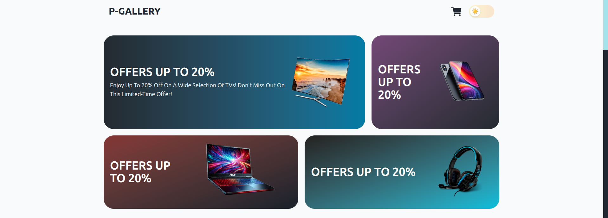
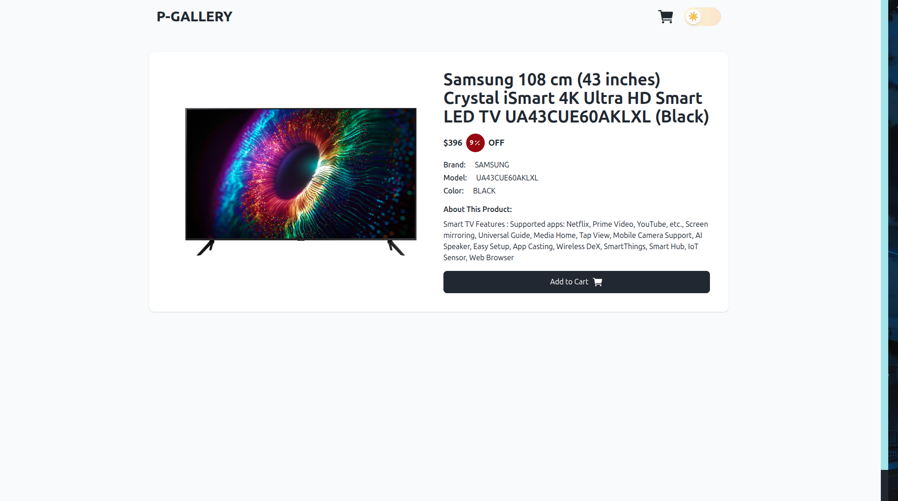
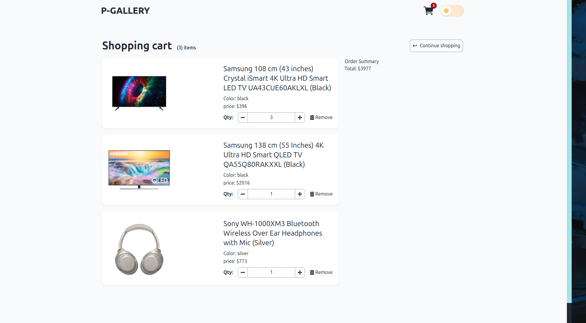

# 🛍️ Products Gallery Web Application

## 🎯 Overview

A fully responsive and interactive Products Gallery web application built using **React.js**, styled with **Tailwind CSS**, and powered by the [FakeStore API](https://fakestoreapi.com/).  
Users can **browse**, **search**, **sort**, and **filter** products, view detailed product pages, and manage their **shopping cart** — all in a smooth and visually engaging experience.

---

## 📸 Demo

[🔗 Live Demo](https://products-gallery-psi.vercel.app/)

---

## ⚙️ Features

### ✅ Core Features

- Fetch product data from [FakeStore API](https://fakestoreapi.com/products)
- Display products in responsive card layout
- Navigate to product details via dynamic route `/products/:id`
- Product filtering by name (case-insensitive search)
- Sorting by:
  - Price: Low to High / High to Low
  - Name: A–Z
- Cart system with:
  - Add to cart
  - Quantity management
  - Cart length display

### 💅 Optional Enhancements (Implemented)

- ✅ Dark Mode toggle
- ✅ Smooth animations using **Motion**
- ✅ Icon usage via **React Icons**
- ✅ LocalStorage integration to persist cart and theme

---

## 🧱 Tech Stack

| Technology        | Purpose                              |
| ----------------- | ------------------------------------ |
| **React.js**      | Frontend Framework                   |
| **Tailwind CSS**  | Styling and responsive design        |
| **Motion**        | Animations and transitions           |
| **React Icons**   | Lightweight and customizable icons   |
| **FakeStore API** | Real-time product data               |
| **React Router**  | Client-side routing                  |
| **LocalStorage**  | Persist cart & theme across sessions |
